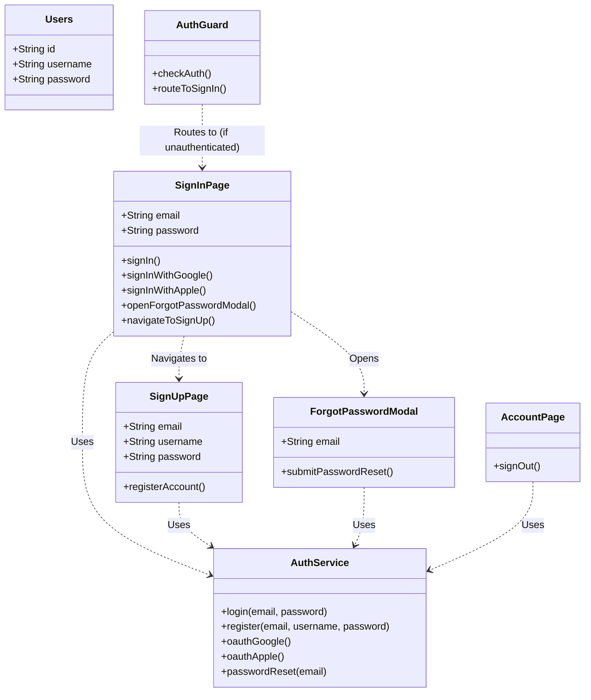

# Authentication System UML Diagram

```mermaid
classDiagram
    class Users {
        +String id
        +String username
        +String password
    }

    class AuthService {
        +login(email, password)
        +register(email, username, password)
        +oauthGoogle()
        +oauthApple()
        +passwordReset(email)
    }

    class AuthGuard {
        +checkAuth()
        +routeToSignIn()
    }

    class SignInPage {
        +String email
        +String password
        +signIn()
        +signInWithGoogle()
        +signInWithApple()
        +openForgotPasswordModal()
        +navigateToSignUp()
    }

    class SignUpPage {
        +String email
        +String username
        +String password
        +registerAccount()
    }

    class ForgotPasswordModal {
        +String email
        +submitPasswordReset()
    }

    class AccountPage {
        +signOut()
    }

    SignInPage ..> AuthService : Uses
    SignUpPage ..> AuthService : Uses
    ForgotPasswordModal ..> AuthService : Uses
    AccountPage ..> AuthService : Uses
    AuthGuard ..> SignInPage : Routes to (if unauthenticated)
    SignInPage ..> SignUpPage : Navigates to
    SignInPage ..> ForgotPasswordModal : Opens
```
