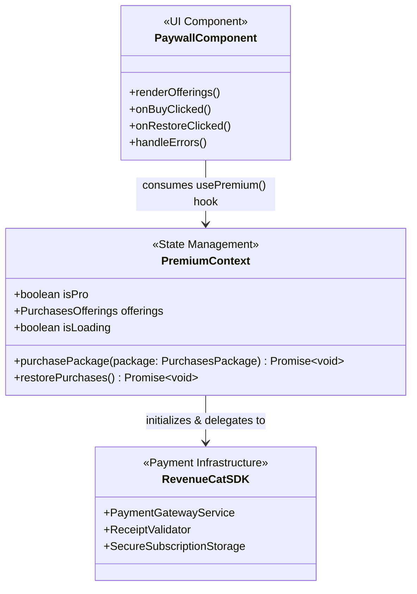

# Payment Architecture UML

Here is the UML diagram representing the React-based architecture for managing payments and subscriptions as described in `payment_classes.md`.

```mermaid
classDiagram
    class PremiumContext {
        <<State Management>>
        +boolean isPro
        +PurchasesOfferings offerings
        +boolean isLoading
        +purchasePackage(package: PurchasesPackage) Promise~void~
        +restorePurchases() Promise~void~
    }

    class PaywallComponent {
        <<UI Component>>
        +renderOfferings()
        +onBuyClicked()
        +onRestoreClicked()
        +handleErrors()
    }

    class RevenueCatSDK {
        <<Payment Infrastructure>>
        +PaymentGatewayService
        +ReceiptValidator
        +SecureSubscriptionStorage
    }

    PaywallComponent --> PremiumContext : consumes usePremium() hook
    PremiumContext --> RevenueCatSDK : initializes & delegates to
```
